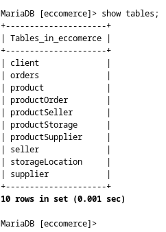

# Projeto de Banco de Dados - Bootcamp

Este é um projeto de banco de dados que foi desenvolvido como parte de um bootcamp. Embora tenha sido concluído com os requisitos mínimos devido ao prazo do bootcamp, considero-o um projeto em aberto que pode ser usado para fins de aprendizado no futuro.

## Estrutura do Banco de Dados

Aqui estão os principais momentos de criação das tabelas do banco de dados:

1. **Criação do Banco de Dados:**
   

2. **Criação da Tabela `product`:**
   

3. **Criação da Tabela `orders`:**
   

4. **Criação da Tabela `productStorage`:**
   

5. **Criação da Tabela `supplier`:**
   

6. **Criação da Tabela `seller`:**
   

7. **Criação da Tabela `productSeller`:**
   

8. **Criação da Tabela `productOrder`:**
   

9. **Criação da Tabela `storageLocation`:**
   

10. **Criação da Tabela `productSupplier`:**
    

11. **Todas as Tabelas:**
    

12. **Todas as Constraints:**
    

## Povoamento dos Dados

A inserção dos dados pode ser encontrada em `/images/povoamento_dos_dados`.

## Consultas SQL

Aqui estão algumas consultas SQL que foram realizadas:

1. **Quantos pedidos foram feitos por cada cliente?**
   

2. **Algum vendedor também é fornecedor?**
   

3. **Relação de nomes dos fornecedores e nomes dos produtos:**
   